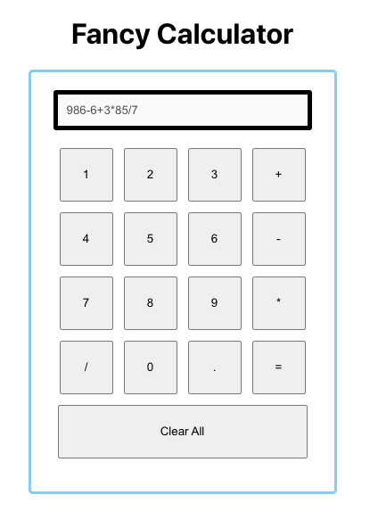

# Fancy Calculator 
This calculator does some basic operations like `addition`, `multiply`, 
`division` and `subtraction`



## Rule
**B** racket (`(), [], {}`)
**O** f (`root, power`)
**D** ivide (`/`)
**M** ultiply (`*`)
**A** ddition (`+`)
**S** ubtraction (`-`)

## Tech Stack
`React.js`, `React Hook`, `node^15.6.0`

## Some useful scripts

1. Run project in development mode
```
$ yarn start
```

2. Run Test
```
$ yarn test
```

> Focused on functioning test mainly, not UI component test. ( Because of lack of time. )

## Project Description

1. Used create-react-app template for simplicity. 

2. **Strategy** Design Principle

For extensibility purpose, used Strategy design pattern in OOP. 

If you want to add more operators, 
- customize the `ALLOWED_OPERATORS` variable from `/utils/config.js`

- Customize `ORDER_RULE` variable from `/utils/config.js`

- Customize `calculate` logic a little depends on a new operator inside Calculator class.

- Customize UI.

3. Application exceptions:
- Adding more than 2 `points (.)` doesn't allow.
- Adding 2 operators sequently (eg. 2+*3) doesn't allow.
> Above exceptions are being handled automatically so calculator does work gracefully without any error.

4. Application works fine:
- Even when you try to add a new operator after 1 calculation being done.

- Even when you try to add a new input for new calculation after 1 calculation being done.
